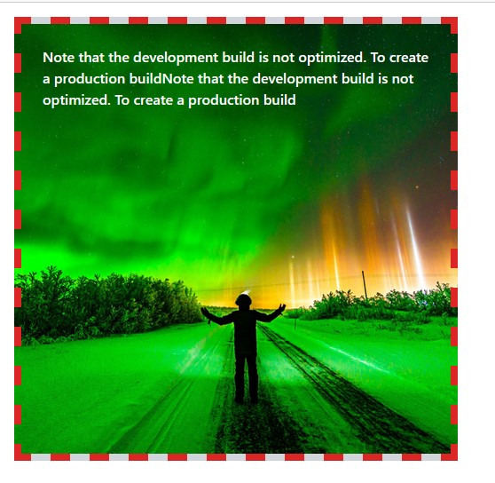
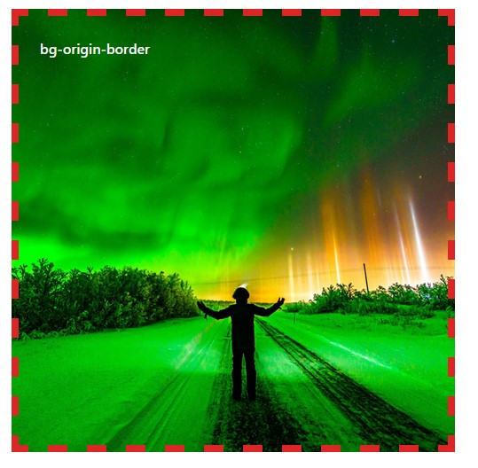
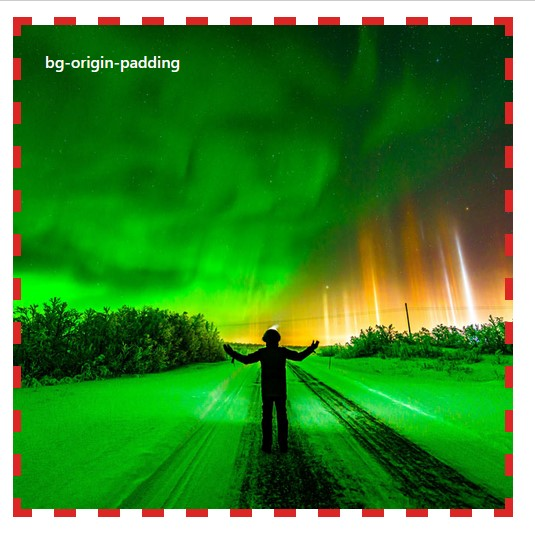
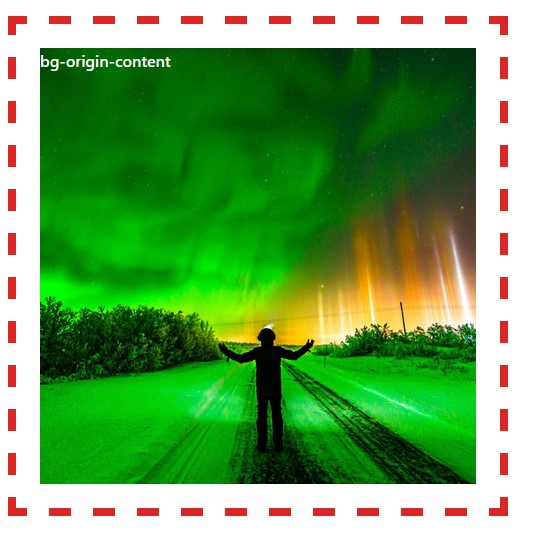

# Background property

- background-color - বেকগ্রাউন্ড কালার নির্বাচনের জন্য।
- background-image - বেকগ্রাউন্ড ইমেজ নির্বাচনের জন্য।
- background-repeat - রিপিটেশন নির্ধারণের জন্য।
- background-position - ইমেজের কোন অংশটুকু প্রদর্শন করবে তা নির্ধারণের জন্য
- background-size - বেকগ্রাউন্ডের সাইজ প্রদানের জন্য।
- background-attachment - বেকগ্রাউন্ড ফিক্সড নাকি স্ক্রল নির্ধারণের জন্য।
- background-clip - বেকগ্রাউন্ড কালার কোথা থেকে শুরু হবে তা নির্ধারণের জন্য।
- background-origin- বেকগ্রাউন্ড ইমেজ কোথা থেকে শুরু হবে তা নির্ধারণের জন্য।

## Shorthand

- বেকগ্রাউন্ড পজিশন না দিলে বেকগ্রাউন্ড সাইজ করবেনা। তাই পজিশন না দিলে ০ ০ লিখতে হবে।

```css
syntax: image/color + repeat + position + /+ size url(images/Scene.jpg)
  no-repeat right bottom/100% 100% url(images/Scene.jpg) no-repeat 0 0/100% 100%
  (without position);
```

# Rule

- যদি বেকগ্রাউন্ড ইমেজের সাইজ তার ডিভের সাইজের চেয়ে ছোট হয় তাহলে ডিভের পুরো সাইজকে কভার করার জন্য ইমেজটি রিপিট হবে। যদি রিপিট বন্ধ করতে হয় তাহলে no-repeat ব্যবহার করতে হবে।
- একটি ডিভে যদি বেকগ্রাউন্ড কালার ও বেকগ্রাউন্ড ইমেজ একসাথে ব্যবহার করা হয় তাহলে ইমেজটি অগ্রাাধিকার পাবে।
- পুরো ছবিটি দেখানোর জন্য ইমেজের সাইজ হবে ১০০% ১০০%
- মেইন অংশটুকু ফোকস করে পুরো ডিভে ইমেজ প্রদর্শনের জন্য ব্যবহার করতে হবে cover
- Image-size: cover ব্যবহর করে image-position: top left এর মাধ্যমে ইমেজের কোন অংশটুকু ফোকাস করা প্রয়োজন তা করতে হবে।

# Example:
- এইখানের মত করে রিএ্যাক্টে বেকগ্রাউন্ড ইমেজ ব্যবহার করতে হবে।
```js
<div
  className="bg-gray-300 m-4 w-[500px] h-[500px] border-8 border-red-600 border-dashed p-6 bg-cover bg-origin-padding bg-no-repeat bg-center"
  style={{ backgroundImage: `url(${heros})` }}
>
  <p className="text-white font-semibold">
    Note that the development build is not optimized. To create a production
    buildNote that the development build is not optimized. To create a
    production build
  </p>
</div>

Without Tailwind:
style={{ backgroundImage: `url(${heros})`, backgroundRepeat:'no-repeat', backgroundPosition:'center', backgroundSize:'cover', backgroundOrigin:'padding-box'}}
```


# background clip/origin
- কোন স্থান থেকে বেকগ্রাউন্ড কালার বা ইমেজ শুরু হবে নির্ধারণ করে।
- কখন কোনটি লাগবে তা clip/origin এবং size:100% 100% / cover এদের মাধ্যমে সমন্বয় করে নিতে হবে।


