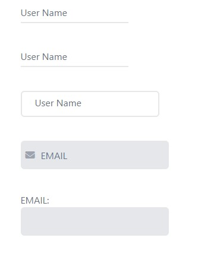
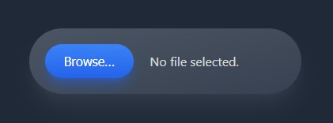

1. [Input](#input)


<a name='input'></a>



<details>
<summary> >>>Input code here...</summary>

```css
<body class="flex items-center justify-center h-screen">
  <div>
    <!------ Floating input ------>
    <div class="relative ">
      <input id="userName" type="text" class="border-b-2 focus:outline-none focus:border-purple-600 transition-colors py-1 text-purple-400 peer"  />
     <label for="userName" class="absolute left-0 top-1 cursor-text peer-focus:text-xs peer-focus:text-purple-600 peer-focus:-top-4 transition-all text-gray-500">User Name</label>
     </div>
    <!------ Floating input with bottom border transition ------>
     <div class="relative mt-10">
      <input id="password" type="text" class="border-b-2 focus:outline-none  transition-colors py-1 text-purple-400 peer"  />
      <div class=" absolute top-full border-b-2 border-purple-600 w-0 peer-focus:w-full transition-all duration-200"></div>
     <label for="password" class="absolute left-0 top-1 cursor-text peer-focus:text-xs peer-focus:text-purple-600 peer-focus:-top-3 transition-all text-gray-500">User Name</label>
     </div>
    <!------ Floating input ------>
     <div class="relative mt-10 ">
      <input id="userName3" type="text" class="border-2 rounded-md focus:outline-none focus:border-purple-600 transition-colors px-6 py-2 text-purple-400 peer"  />
     <label for="userName3" class="absolute left-6 top-2 cursor-text peer-focus:text-xs peer-focus:text-purple-600 peer-focus:-top-2.5 peer-focus:px-2 peer-focus:bg-white peer-focus:border-x peer-focus:border-purple-500 transition-all text-gray-500">User Name</label>
     </div>
     <!------ input with icon ------>
     <div class="relative mt-10 flex items-center">
      <span class="text-gray-400 absolute ml-2 cursor-none"><i class="fa-solid fa-envelope" ></i></span>
      <input class="h-12 px-8 border-2 rounded-md bg-gray-200 focus:outline-none focus:border-2 focus:border-purple-400 transition-all placeholder-slate-500" placeholder="EMAIL"/>
     </div>
     <!------ input with only lavel ------>
     <div class="mt-10">
      <label for="email" class="block text-gray-500">EMAIL:</label>
      <input id="email" class="h-12 px-8 border-2 rounded-md bg-gray-200 focus:outline-none focus:border-2 focus:border-purple-400 transition-all placeholder-slate-500"/>
     </div>
  </div>
  </body>
```
# Floating input
- Create input & lavel.
- declare absoulute in lavel against div and setting in input.
- use tranisition-color in input for transition and hide outline.
- use id in input and for in label for active focus in label name.
- use peer in input and work in label against peer.

# Floating input with bottom border transition
- By div create bottom border transition
- primay h-0 and focus h-full
- in absolute by h-full match border with input.

# input with icon
- icon set use absoulute asainst div.
- in input icon center by item-center.
</details>

# Input (type-file)



<details>
<summary> >>> Code here....</summary>

```js
<div className='bg-gray-800 h-screen flex items-center justify-center'>
        <input
        type='file'
        class="
          file:bg-gradient-to-b file:from-blue-500 file:to-blue-600
          file:px-6 file:py-3 file:m-5
          file:border-none
          file:rounded-full
          file:text-white
          file:cursor-pointer
          file:shadow-lg file:shadow-blue-600/50

          bg-gradient-to-br from-gray-600 to-gray-700
          text-white/80
          rounded-full
          cursor-pointer
          shadow-xl shadow-gray-700/60
        "
        />
      </div>
      ```
</details>