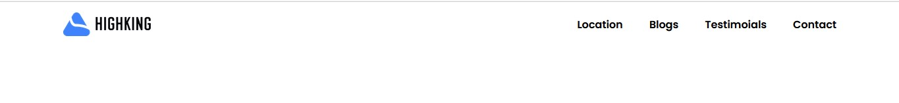
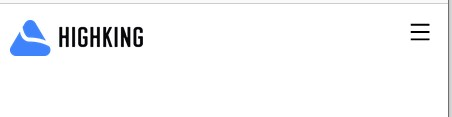
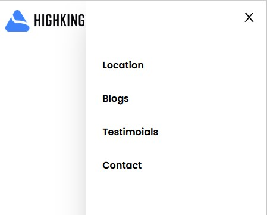

# Horizental RH Navigation Bar  

## Demo when medium screen


## Demo when small screen & close content


## Demo when small screen & open content


## Header.js
- ইহা হল মেইন লেআউট অর্থাৎ কন্টেইনার 
- এখানে নির্ধারণ করা হল মিডিয়াম স্ক্রিন এ দুইপাশে ২৪ করে প্যাডিং দিতে হবে। স্মল স্ক্রিন এ দুই এক্সিস বরাবর ৪ করে প্যাডিং দিতে হবে।
- তার নেভিগেশন লোড হবে।
```js
import React from "react";
import Nav from "./Nav";

const Header = () => {
  return (
    <div className="md:px-24 px-4 py-4">
      <Nav />
    </div>
  );
};
export default Header;
```
## Nav.js
- এখানে Navlink থেকে মেনু ও লিংক লোড হবে। 
### Medium screen
- দুইটি পার্ট লোগো এবং কনটেন্ট যাহা ফ্লেক্স এর মাধ্যমে বিটউইন থাকবে।
- এই পার্টে কনটেন্টগুলো মিডিয়াম স্ক্রিন এর জন্য ফ্লেক্স থাকবে এবং স্মল স্ক্রিন এর জন্য হাইড থাকবে।
### Small screen
- পুনরায় Navlink কে কল করতে হবে।
- এই পার্টে কনটেন্টগুলো স্মল স্ক্রিন এর জন্য ফ্লেক্স  কলাম থাকবে এবং মিডিয়াম স্ক্রিন এর জন্য হাইড থাকবে।
- এখন তার হাইট ওয়াইডথ  শেডো প্যাডিং নির্ধারণ করতে হবে।
- পজিশন ফিক্সড করে টপ থেকে ০ করতে হবে।
- একটি ডিভে দুইটি আইকন নিতে হবে যাহা মিডিয়াম স্ক্রিন এর জন্য হাইড থাকবে। যখন মেনুতে ক্লিক করবে তখন কনটেন্ট ওপেন হবে যখন ক্রস এ ক্লিক করবে তখন কনটেন্ট হাইড হবে।
- এখন  এর মধ্যে নির্ধারণ করা হলো ওপেন অবস্থায় কনটেন্ট ডান সাইড থেকে আসবে ও ক্লোজ অবস্থায় কনটেন্ট ডান সাইডে চলে যাবে। 
- উভয়ের ইনডক্স সমান হওয়ার কারণে একই সাথে উভয়েই প্রদর্শিত হয়।
```js
import React, { useState } from 'react'
import logo from '../assets/images/logo.png'
import Navlink from './Navlink'
import { AiOutlineMenu, AiOutlineClose } from "react-icons/ai";

const Nav = () => {
    const [open, setOpen] = useState(true)
  return (
    <nav className='flex justify-between'>
        

        <ul className='md:flex hidden gap-10  items-center'>
            <Navlink />
        </ul>


        {/* .......For Mobile..........  */}
        <ul className={`fixed top-0 z-50 bg-white shadow-2xl h-screen w-2/3 md:hidden flex flex-col gap-8 p-7 pt-24 duration-500 ${open ? 'right-0' : 'right-[-100%]'}`}>
        <Navlink />  
        </ul>
        <div className='md:hidden z-50 ' onClick={()=>setOpen(!open)}>
           {
            open ? <AiOutlineClose className='cursor-pointer text-2xl '/> :  <AiOutlineMenu className='cursor-pointer text-2xl' />
           }
        </div>
    </nav>
  )
}
export default Nav
```
### Navlink.js
```js
import React from "react";

const Navlink = () => {
  const Link = [
    {
      name: "Location",
      link: "/",
    },
    {
      name: "Blogs",
      link: "/",
    },
    {
      name: "Testimoials",
      link: "/",
    },
    {
      name: "Contact",
      link: "/",
    },
  ];
  return (
    <>
      {Link.map((link, index) => (
        <li
          key={index}
          className="font-semibold hover:text-primary duration-200"
        >
          <a href={link.link}>{link.name}</a>
        </li>
      ))}
    </>
  );
};

export default Navlink;

```