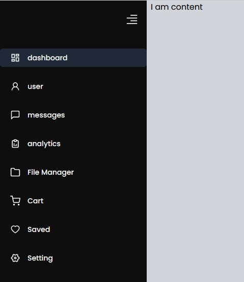
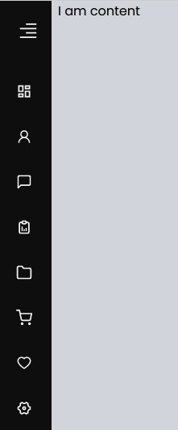
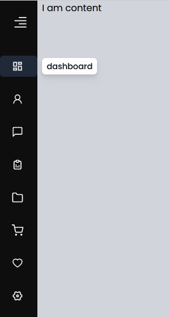

# Horizental RH Navigation Bar  

## Demo when medium screen


## Demo when small screen & close content


## Demo when small screen with hover tooltip


## Header.js
- ইহা হল মেইন লেআউট অর্থাৎ কন্টেইনার 
- এখানে নেভিগেশন কল করা হল। এই স্থান থেকে প্রপসের মাধ্যমে মেইন লেআউট প্রদর্শিত হবে।
```js
import React from "react";
import Nav from "./Nav";

const Header = (props) => {
  return (
    <>
      <div className="flex gap-x-2 bg-gray-300">
        <Nav />
        <div>
          {props.children}
        </div>
      </div>
    </>
  );
};
export default Header;
```
## Nav.js
- এখানে Navlink থেকে মেনু ও লিংক লোড হবে। 
- যদি মেনু ওপেন থাকে তাহলে ওয়াইডথ হবে ৭২ এবং ক্লোজ থাকলে ওয়াইডথ হবে ১৬।
- মেনু বাটনে ক্লিক করলে স্ট্যাট পরিবর্তন হবে।
- নেভলিংক লোড হবে।
- স্ট্যাট এর ভেল্যুকে প্রপস এর মাধ্যমে নেভলিংকে পাঠোনো হল। 

import Navlink from "./Navlink";

const Nav = () => {
    const [open, setOpen] = useState(true)
  return (
    <nav>
      <div className={`bg-[#0e0e0e] min-h-screen text-gray-100  ${open ? 'w-72' : 'w-16'} transition-all duration-500 ease-in`}>

        <div className="py-6 flex justify-end px-4">
          <AiOutlineAlignRight size={26} onClick={()=>setOpen(!open)} className='cursor-pointer' />
        </div>

        <ul>
            <Navlink open={open} />
        </ul>
      </div>
    </nav>
  );
};
export default Nav;
```
### Navlink.js
- এলআই এর ক্লাসের মাধ্যমে এ্যাংকর ট্যাগের এলিমেন্টগুলোকে কলাম অনুসারে সাজানো হয়েছে।
- a ট্যাগের ডিভের ফ্লেক্স এর মাধ্যমে আইকন ও নেমগুলোকে পাশাপাশি আনা হয়েছে।
- style এর মাধ্যমে নামগুলো প্রদর্শনের সময় এ্যানিমেশন প্রদান করা হয়েছে।
- দ্বিতীয় h2 এর মাধ্যমে ‍টুলটিপ তৈরী করা হয়েছে। অবসোলিট করা হয়েছে a ট্যাগের সাপেক্ষে। 
- টুলটিপ: অবসোলিট করে a ট্যাগের সাপেক্ষে প্রথমে নামগুলোকে লেফট থেকে ৩৬ সরানো হয়েছে, প্যাডিং ও ওয়াইডথ ০ করা হয়েছে। গ্রুপ হোভার এর মাধ্যমে পরে লেফট থেকে ১৬ সরানো হয়েছে, প্যাডিং ও ওয়াইডথ দেওয়া হয়েছে। গ্রুপ হোভার ব্যবহার করার জন্য a ট্যাগের ডিভের ফ্লেক্সকে গ্রুপ করা হয়েছে। 
```js
import React from "react";

import { MdOutlineDashboard } from "react-icons/md";
import { RiSettings4Line } from "react-icons/ri";
import { TbReportAnalytics } from "react-icons/tb";
import { AiOutlineUser, AiOutlineHeart } from "react-icons/ai";
import { FiMessageSquare, FiFolder, FiShoppingCart } from "react-icons/fi";

const Navlink = (props) => {
  console.log(!props.open);
  const menus = [
    { name: "dashboard", link: "/", icon: MdOutlineDashboard },
    { name: "user", link: "/", icon: AiOutlineUser },
    { name: "messages", link: "/", icon: FiMessageSquare },
    { name: "analytics", link: "/", icon: TbReportAnalytics, padding: true },
    { name: "File Manager", link: "/", icon: FiFolder },
    { name: "Cart", link: "/", icon: FiShoppingCart },
    { name: "Saved", link: "/", icon: AiOutlineHeart, padding: true },
    { name: "Setting", link: "/", icon: RiSettings4Line },
  ];
  return (
    <div>
      {menus.map((menu, index) => (
        <li
          key={index}
          className={`flex flex-col gap-4 text-sm font-medium hover:bg-gray-800 p-2 mt-5 rounded-md `}
        >
          <a href={menu.link} className={`relative`}>

            <div className={`group flex items-center gap-3.5 pl-3 `}>
              <span> {React.createElement(menu.icon, { size: "20" })}</span> // আইকন প্রদর্শনের নিয়ম।

              <h2
                style={{
                  transitionDelay: `${index + 3}00ms`, 
                }}
                className={`whitespace-pre duration-500 ${
                  !props.open && "opacity-0 translate-x-28 overflow-hidden"
                }`}
              >
                {menu.name}
              </h2>
              <h2
                className={`${
                  props.open && "hidden"
                } bg-white px-0 py-0 w-0 drop-shadow-lg rounded-md text-gray-900 absolute left-36 whitespace-pre group-hover:px-2 group-hover:py-1 group-hover:left-16 group-hover:duration-300 group-hover:w-fit overflow-hidden`}
              >
                {menu.name}
              </h2>
            </div>
          </a>
        </li>
      ))}
    </div>
  );
};

export default Navlink;


```