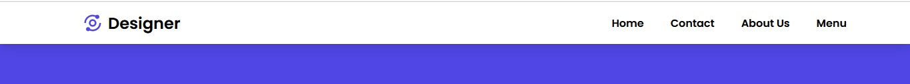

1. [Top Navigation Bar](#topNav)
1. [LH Side Navigation Bar](#LHSideBar)
1. [LH Side Navigation Bar With Tooltip](#LHSideBarTooltip)
1. [Horizental RH Navigation Bar](#RHNav)


<a name='topNav'></a>

# Top Navigation Bar  

> ***## Demo of medium screen***



> ***## Demo of small screen & close content***


> ***## Demo of small screen & open content***


<details>
<summary> >>>>>Top Nav Bar Code here....</summary>

## Header.js
- ইহা হল মেইন লেআউট অর্থাৎ কন্টেইনার 
- এখানে নির্ধারণ করা হল মিডিয়াম স্ক্রিন এর ওয়াইডথ ও হাইট।
```js
import React from "react";
import Nav from "./Nav";

const Header = (props) => {
  return (
    <div className="bg-indigo-600 w-full h-screen">
      <Nav />
      {props.children}
    </div>
  );
};

export default Header;
```
## Nav.js
- এখানে Navlink থেকে মেনু ও লিংক লোড হবে। 
### Medium screen
- দুইটি পার্ট লোগো এবং কনটেন্ট যাহা ফ্লেক্স এর মাধ্যমে বিটউইন থাকবে।
- এই পার্টে কনটেন্টগুলো মিডিয়াম স্ক্রিন এর জন্য ফ্লেক্স থাকবে এবং স্মল স্ক্রিন এর জন্য হাইড থাকবে।
### Small screen
- পুনরায় Navlink কে কল করতে হবে।
- এই পার্টে কনটেন্টগুলো স্মল স্ক্রিন এর জন্য ফ্লেক্স  কলাম থাকবে এবং মিডিয়াম স্ক্রিন এর জন্য হাইড থাকবে।
- এখন তার হাইট ওয়াইডথ  শেডো প্যাডিং নির্ধারণ করতে হবে।
- পজিশন ফিক্সড করা হলো।
- একটি ডিভে দুইটি আইকন নিতে হবে যাহা মিডিয়াম স্ক্রিন এর জন্য হাইড থাকবে। যখন মেনুতে ক্লিক করবে তখন কনটেন্ট ওপেন হবে যখন ক্রস এ ক্লিক করবে তখন কনটেন্ট হাইড হবে।
- এখন  এর মধ্যে নির্ধারণ করা হলো ওপেন অবস্থায় কনটেন্ট ডান সাইড থেকে আসবে ও ক্লোজ অবস্থায় কনটেন্ট ডান সাইডে চলে যাবে। 
- উভয়ের ইনডক্স সমান হওয়ার কারণে একই সাথে উভয়েই প্রদর্শিত হয়।
```js
import React, { useState } from 'react'
import { BiAnalyse } from "react-icons/bi";
import Navlink from './Navlink'
import { AiOutlineMenu, AiOutlineClose } from "react-icons/ai";

const Nav = () => {
    const [open, setOpen] = useState(false)
  return (
    <nav className='flex items-center justify-between bg-white py-4 w-full shadow-lg md:px-24 '>
        <div className="flex items-center font-bold text-2xl space-x-2 px-7">   
          <span className="text-indigo-600 text-3xl">
            <BiAnalyse />
          </span>
          <span>Designer</span>
        </div>

        <ul className='md:flex hidden gap-10  items-center'>
            <Navlink />
        </ul>
        {/* .......For Mobile..........  */}
        <ul className={`fixed z-50 bg-white w-full md:hidden flex flex-col gap-8 p-7 transition-all ease-in duration-500 ${
            open ? "top-[65px] " : "top-[-600px] "
          } `}>
        <Navlink />  
        </ul>
        <div className='md:hidden z-50 px-7 ' onClick={()=>setOpen(!open)}>
           {
            open ? <AiOutlineClose className='cursor-pointer text-2xl '/> :  <AiOutlineMenu className='cursor-pointer text-2xl' />
           }
        </div>
    </nav>
  )
}

export default Nav
```
### Navlink.js
```js
import React from "react";

const Navlink = () => {
  const Link = [
    { name: "Home", link: "/" },
    { name: "Contact", link: "/" },
    { name: "About Us", link: "/" },
    { name: "Menu", link: "/" },
  ];
  return (
    <>
      {Link.map((link, index) => (
        <li
          key={index}
          className="font-semibold hover:text-primary duration-200"
        >
          <a href={link.link}>{link.name}</a>
        </li>
      ))}
    </>
  );
};

export default Navlink;
```
</details>

# Top Navigation Bar 2

> ***## Demo of large screen***


> ***## Demo of small screen when menu close***


> ***## Demo of small screen when menu open***


<details>
<summary> >>> Top Navigation Bar 2 code here....</summary>

## মিডিয়াম স্ক্রিন
- মেনুগুলো ফ্লেক্স রো বরাবর থাকবে, মেনুবারের নাম ও মেনুগুলো জাস্টিফাই বিটোইন থাকবে।

## স্মল স্ক্রিন
- মেনুগলো li এর মাধ্যমে নিচে নিচে থাকবে।
- দুইটি আইকেন থাকবে একটি মেনু আরেকটি ক্রস।
- যখন ওপেন থাকবে তখন ক্রস প্রদর্শিত হবে অন্যসময় মেনু প্রদর্শিত হবে। 
- মেনুতে ক্লিক করলে মেনুবার আসবে এবং ক্রস এ ক্লিক করলে মেনুবার চলে যাবে। 


```js
import React, { useState } from "react";
import { BiAnalyse } from "react-icons/bi";
import { AiOutlineMenu, AiOutlineClose } from "react-icons/ai";

const Timeline = () => {
  const [isOpen, setIsOpen] = useState(false);
  let Link = [
    { name: "Home", link: "/" },
    { name: "Contact", link: "/" },
    { name: "About Us", link: "/" },
    { name: "Menu", link: "/" },
  ];
  const timeline = () => (
/* ...........body............*/
    <div className="bg-indigo-600 w-full h-screen"> 

/* ...........Menubar............*/
      <div className="shadow-lg w-full fixed bg-white py-4 md:flex md:items-center md:justify-between">    //This is menubar

/* ...........menubar name and icon............*/
        <div className="flex items-center font-bold text-2xl space-x-2 md:px-10 px-7">   
          <span className="text-indigo-600 text-3xl">
            <BiAnalyse />
          </span>
          <span>Designer</span>
        </div>
/* ...........open and show icon............*/
        <div
          onClick={() => setIsOpen(!isOpen)}
          className="absolute right-4 top-4 text-2xl md:hidden"
        >
          {isOpen ? <AiOutlineClose /> : <AiOutlineMenu />}
        </div>

/* ...........open and show ul/li items............*/
        <ul
          className={`md:flex md:items-center px-7 md:pb-0 pb-7 transition-all duration-500 ease-in ${
            isOpen ? "top-[65px] " : "top-[-490px] "
          } md:opacity-100 absolute bg-white w-full md:w-auto md:static md:z-auto z-[-1] `}
        >
          {Link.map((link) => (
            <li className="md:ml-8 text-xl md:my-0 my-7">
              <a
                className="text-gray-800 hover:text-gray-400 duration-500"
                href={link.link}
              >
                {link.name}
              </a>
            </li>
          ))}
          <button className="text-white bg-indigo-600 px-2 py-2 rounded-md hover:bg-indigo-400 md:ml-8 md:mr-8 duration-500">
            Get Started
          </button>
        </ul>
      </div>
    </div>
  );

  return <div>{timeline()}</div>;
};

export default Timeline;
```
</details>

# LH Side Navigation Bar

> ***## Demo of medium screen***


> ***## Demo of small screen & close content***


<a name='LHSideBar'></a>

<details>
<summary>>>>>LH Side Bar Code here....</summary>

# LH Sidebar
- Main div divided by sidebar + Homepage
- By state when sidebar open set width and when sidebar close set width. Other width is for Homepage.
- By flex main div create two dive side to side.

```js
import React, { useState } from "react";
import controlImg  from './assets/images/control.png'
import logo  from './assets/images/logo.png'
import calender  from './assets/images/Calendar.png'
import chart_fill  from './assets/images/Chart_fill.png'
import chart  from './assets/images/Chart.png'
import chat  from './assets/images/Chat.png'
import folder  from './assets/images/Folder.png'
import search  from './assets/images/Search.png'
import setting  from './assets/images/Setting.png'
import user  from './assets/images/User.png'

export const Home = () => {
  const Menus = [
    { title: "Dashboard", src:[chart_fill] },
    { title: "Inbox", src: [chat] },
    { title: "Accounts", src: [user], gap: true },
    { title: "Schedule ", src: [calender] },
    { title: "Search", src:[search] },
    { title: "Analytics", src: [chart] },
    { title: "Files ", src:[folder], gap: true },
    { title: "Setting", src: [setting] },
  ];

  const [open, setOpen] = useState(true)
  const sidebar = () => (
    <div className="flex">
      {/* ..............................Sidebar........................ */}
      <div className={`${open ? 'w-72' : 'w-20'} h-screen bg-dark-purple relative transition-all duration-500 ease-in pt-8 p-5 `}>
         setOpen(!open)}
        />
      <div className={`flex gap-x-4 items-center origin-left `}>
        
        <h1 className={`text-white font-semibold text-xl ${!open && 'scale-0'} duration-500`}>Designer</h1> // যখন ‍বার ক্লোজ হবে তখন টাইটেল লেখাগুলো হাইড হবে।
      </div>
      <ul className="pt-6">
        {
          Menus.map((menu, index)=>(
           <li key={index} className={`flex items-center gap-x-4 p-2 hover:bg-light-white rounded-md ${menu.gap ? 'mt-9' : 'mt-2'}`}> // গ্যাপ তৈরী করা হয়েছে।
            
            <span className={`text-gray-300 text-sm cursor-pointer ${!open && 'scale-0' } duration-500   `}>{menu.title}</span> // যখন ‍বার ক্লোজ হবে তখন টাইটেল লেখাগুলো হাইড হবে।
           </li>
          ))
        }
      </ul>

      </div>

      {/* ..............................Homepage........................ */}
      <div className="p-7 text-2xl font-semibold flex-1 h-screen">Homepage</div>
    </div>
  );
  return <div>{sidebar()}</div>;
};
export default Home;
```
</details>

<a name='LHSideBarTooltip'></a>

# LH Navigation Side Bar With Tooltip  

> ***## Demo of medium screen***


> ***## Demo of small screen & close content***


> ***## Demo when small screen with hover tooltip***


<details>
<summary> >>>LH Side Navigation Bar Code here...</summary>

## Header.js
- ইহা হল মেইন লেআউট অর্থাৎ কন্টেইনার 
- এখানে নেভিগেশন কল করা হল। এই স্থান থেকে প্রপসের মাধ্যমে মেইন লেআউট প্রদর্শিত হবে।
```js
import React from "react";
import Nav from "./Nav";

const Header = (props) => {
  return (
    <>
      <div className="flex gap-x-2 bg-gray-300">
        <Nav />
        <div>
          {props.children}
        </div>
      </div>
    </>
  );
};
export default Header;
```
## Nav.js
- এখানে Navlink থেকে মেনু ও লিংক লোড হবে। 
- যদি মেনু ওপেন থাকে তাহলে ওয়াইডথ হবে ৭২ এবং ক্লোজ থাকলে ওয়াইডথ হবে ১৬।
- মেনু বাটনে ক্লিক করলে স্ট্যাট পরিবর্তন হবে।
- নেভলিংক লোড হবে।
- স্ট্যাট এর ভেল্যুকে প্রপস এর মাধ্যমে নেভলিংকে পাঠোনো হল। 

```js
import Navlink from "./Navlink";

const Nav = () => {
    const [open, setOpen] = useState(true)
  return (
    <nav>
      <div className={`bg-[#0e0e0e] min-h-screen text-gray-100  ${open ? 'w-72' : 'w-16'} transition-all duration-500 ease-in`}>

        <div className="py-6 flex justify-end px-4">
          <AiOutlineAlignRight size={26} onClick={()=>setOpen(!open)} className='cursor-pointer' />
        </div>

        <ul>
            <Navlink open={open} />
        </ul>
      </div>
    </nav>
  );
};
export default Nav;
```
### Navlink.js

- এলআই এর ক্লাসের মাধ্যমে এ্যাংকর ট্যাগের এলিমেন্টগুলোকে কলাম অনুসারে সাজানো হয়েছে।
- a ট্যাগের ডিভের ফ্লেক্স এর মাধ্যমে আইকন ও নেমগুলোকে পাশাপাশি আনা হয়েছে।
- style এর মাধ্যমে নামগুলো প্রদর্শনের সময় এ্যানিমেশন প্রদান করা হয়েছে।
- দ্বিতীয় h2 এর মাধ্যমে ‍টুলটিপ তৈরী করা হয়েছে। অবসোলিট করা হয়েছে a ট্যাগের সাপেক্ষে। 
- টুলটিপ: অবসোলিট করে a ট্যাগের সাপেক্ষে প্রথমে নামগুলোকে লেফট থেকে ৩৬ সরানো হয়েছে, প্যাডিং ও ওয়াইডথ ০ করা হয়েছে। গ্রুপ হোভার এর মাধ্যমে পরে লেফট থেকে ১৬ সরানো হয়েছে, প্যাডিং ও ওয়াইডথ দেওয়া হয়েছে। গ্রুপ হোভার ব্যবহার করার জন্য a ট্যাগের ডিভের ফ্লেক্সকে গ্রুপ করা হয়েছে। 

```js
import React from "react";

import { MdOutlineDashboard } from "react-icons/md";
import { RiSettings4Line } from "react-icons/ri";
import { TbReportAnalytics } from "react-icons/tb";
import { AiOutlineUser, AiOutlineHeart } from "react-icons/ai";
import { FiMessageSquare, FiFolder, FiShoppingCart } from "react-icons/fi";

const Navlink = (props) => {
  console.log(!props.open);
  const menus = [
    { name: "dashboard", link: "/", icon: MdOutlineDashboard },
    { name: "user", link: "/", icon: AiOutlineUser },
    { name: "messages", link: "/", icon: FiMessageSquare },
    { name: "analytics", link: "/", icon: TbReportAnalytics, padding: true },
    { name: "File Manager", link: "/", icon: FiFolder },
    { name: "Cart", link: "/", icon: FiShoppingCart },
    { name: "Saved", link: "/", icon: AiOutlineHeart, padding: true },
    { name: "Setting", link: "/", icon: RiSettings4Line },
  ];
  return (
    <div>
      {menus.map((menu, index) => (
        <li
          key={index}
          className={`flex flex-col gap-4 text-sm font-medium hover:bg-gray-800 p-2 mt-5 rounded-md `}
        >
          <a href={menu.link} className={`relative`}>

            <div className={`group flex items-center gap-3.5 pl-3 `}>
              <span> {React.createElement(menu.icon, { size: "20" })}</span> // আইকন প্রদর্শনের নিয়ম।

              <h2
                style={{
                  transitionDelay: `${index + 3}00ms`, 
                }}
                className={`whitespace-pre duration-500 ${
                  !props.open && "opacity-0 translate-x-28 overflow-hidden"
                }`}
              >
                {menu.name}
              </h2>
              <h2
                className={`${
                  props.open && "hidden"
                } bg-white px-0 py-0 w-0 drop-shadow-lg rounded-md text-gray-900 absolute left-36 whitespace-pre group-hover:px-2 group-hover:py-1 group-hover:left-16 group-hover:duration-300 group-hover:w-fit overflow-hidden`}
              >
                {menu.name}
              </h2>
            </div>
          </a>
        </li>
      ))}
    </div>
  );
};

export default Navlink;

```
</details>

<a name='RHNav'></a>

# Horizental RH Navigation Bar  

## Demo when medium screen


## Demo when small screen & close content


## Demo when small screen & open content


<details>
<summary> >>>Horizental RH Navigation Bar code here...</summary>

## Header.js
- ইহা হল মেইন লেআউট অর্থাৎ কন্টেইনার 
- এখানে নির্ধারণ করা হল মিডিয়াম স্ক্রিন এ দুইপাশে ২৪ করে প্যাডিং দিতে হবে। স্মল স্ক্রিন এ দুই এক্সিস বরাবর ৪ করে প্যাডিং দিতে হবে।
- তার নেভিগেশন লোড হবে।
```js
import React from "react";
import Nav from "./Nav";

const Header = () => {
  return (
    <div className="md:px-24 px-4 py-4">
      <Nav />
    </div>
  );
};
export default Header;
```
## Nav.js
- এখানে Navlink থেকে মেনু ও লিংক লোড হবে। 
### Medium screen
- দুইটি পার্ট লোগো এবং কনটেন্ট যাহা ফ্লেক্স এর মাধ্যমে বিটউইন থাকবে।
- এই পার্টে কনটেন্টগুলো মিডিয়াম স্ক্রিন এর জন্য ফ্লেক্স থাকবে এবং স্মল স্ক্রিন এর জন্য হাইড থাকবে।
### Small screen
- পুনরায় Navlink কে কল করতে হবে।
- এই পার্টে কনটেন্টগুলো স্মল স্ক্রিন এর জন্য ফ্লেক্স  কলাম থাকবে এবং মিডিয়াম স্ক্রিন এর জন্য হাইড থাকবে।
- এখন তার হাইট ওয়াইডথ  শেডো প্যাডিং নির্ধারণ করতে হবে।
- পজিশন ফিক্সড করে টপ থেকে ০ করতে হবে।
- একটি ডিভে দুইটি আইকন নিতে হবে যাহা মিডিয়াম স্ক্রিন এর জন্য হাইড থাকবে। যখন মেনুতে ক্লিক করবে তখন কনটেন্ট ওপেন হবে যখন ক্রস এ ক্লিক করবে তখন কনটেন্ট হাইড হবে।
- এখন  এর মধ্যে নির্ধারণ করা হলো ওপেন অবস্থায় কনটেন্ট ডান সাইড থেকে আসবে ও ক্লোজ অবস্থায় কনটেন্ট ডান সাইডে চলে যাবে। 
- উভয়ের ইনডক্স সমান হওয়ার কারণে একই সাথে উভয়েই প্রদর্শিত হয়।
```js
import React, { useState } from 'react'
import logo from '../assets/images/logo.png'
import Navlink from './Navlink'
import { AiOutlineMenu, AiOutlineClose } from "react-icons/ai";

const Nav = () => {
    const [open, setOpen] = useState(true)
  return (
    <nav className='flex justify-between'>
        

        <ul className='md:flex hidden gap-10  items-center'>
            <Navlink />
        </ul>


        {/* .......For Mobile..........  */}
        <ul className={`fixed top-0 z-50 bg-white shadow-2xl h-screen w-2/3 md:hidden flex flex-col gap-8 p-7 pt-24 duration-500 ${open ? 'right-0' : 'right-[-100%]'}`}>
        <Navlink />  
        </ul>
        <div className='md:hidden z-50 ' onClick={()=>setOpen(!open)}>
           {
            open ? <AiOutlineClose className='cursor-pointer text-2xl '/> :  <AiOutlineMenu className='cursor-pointer text-2xl' />
           }
        </div>
    </nav>
  )
}
export default Nav
```
### Navlink.js
```js
import React from "react";

const Navlink = () => {
  const Link = [
    {
      name: "Location",
      link: "/",
    },
    {
      name: "Blogs",
      link: "/",
    },
    {
      name: "Testimoials",
      link: "/",
    },
    {
      name: "Contact",
      link: "/",
    },
  ];
  return (
    <>
      {Link.map((link, index) => (
        <li
          key={index}
          className="font-semibold hover:text-primary duration-200"
        >
          <a href={link.link}>{link.name}</a>
        </li>
      ))}
    </>
  );
};

export default Navlink;

```
</details>

