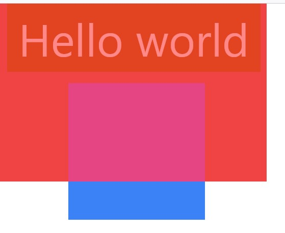
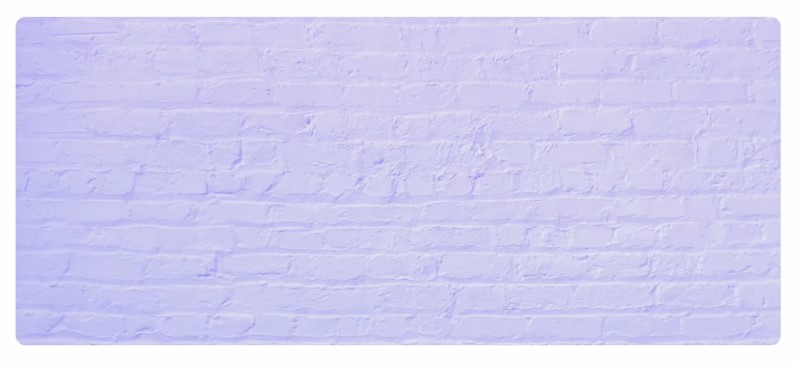
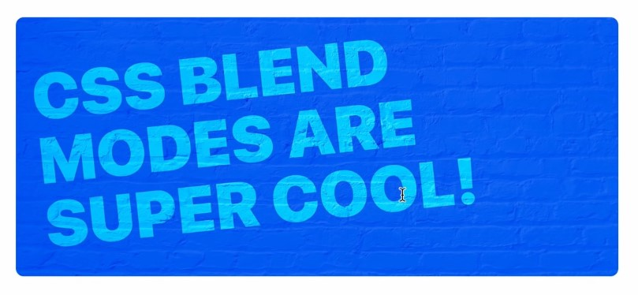

# mix-blend/bg-blend
- mix-blend ব্যবহার করা হয় কন্টেন্টের বেকগ্রাউন্ডের উপর ভিত্তি করে বিভিন্ন ইফেক্ট প্রদান করার জন্য। 
- bg-blend ব্যবহার করা হয় বেকগ্রাউন্ড ইমেজের বা কালারের বেকগ্রাউন্ডের উপর ভিত্তি করে বিভিন্ন ইফেক্ট প্রদান করার জন্য। 
```js
<div className="relative ">
      <div className="w-[750px] h-[500px] bg-red-500 "></div>
      <div className="bg-blue-500 w-96 h-96 absolute top-56 left-48 mix-blend-overlay"></div>
      <h1 className="bg-green-700 inline-block p-8 text-9xl text-white absolute top-0 left-5 mix-blend-overlay">Hello world</h1>
    </div>
```
## Result
- blue ডিভটিকে ও h1 অবসোলিট করে লাল ডিভের উপর নেওয়া হয়েছে।
- blue ডিভটিকে mix-blend-overlay দেওয়ার কারণে সে তার ব্রেকগ্রাউন্ড কালার লালের উপর ভিত্তি করে ওভারলে হয়েছে। কিন্তু তার যে অংশটুকু লালের উপর যায়নি সে ওভারলে হয়নি কারণ বেকগ্রাউন্ড কালার ছাড়া বেল্ড কাজ করবেনা। 
- অপরদিকে h1 কেও ওভারলে করা হয়েছে। 
- এভাবে যেকোন লেখা বা ইমেজকে বেল্ড করে বিভিন্ন ইফেক্ট প্রদান করা হয়। 


## Example

