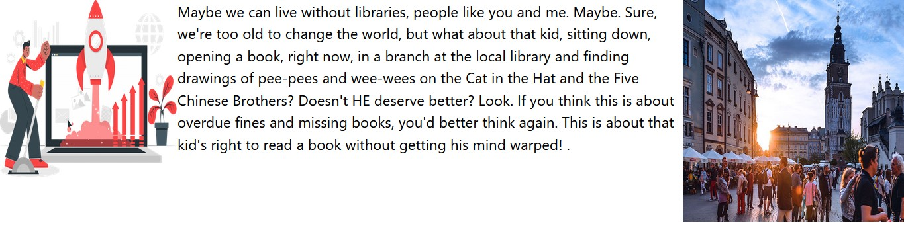
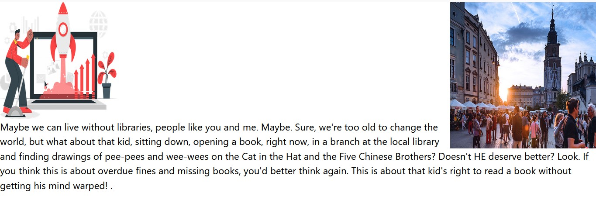
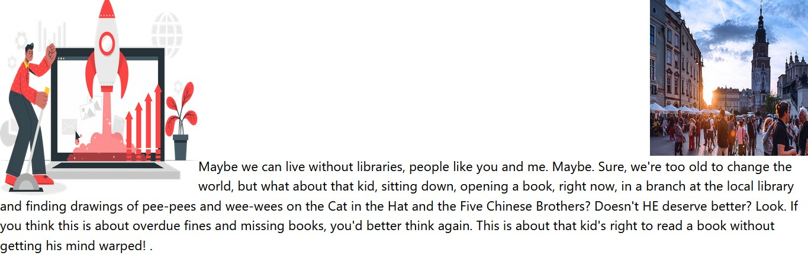

# Floats
- ইহা ব্যবহার করে এলিমেন্ট এর ডান ও বামের স্থানকে খালি করার জন্য।  
```js
<div>
        
        
        <p>
          Maybe we can live without libraries, people like you and me. Maybe.
          Sure, we're too old to change the world, but what about that kid,
          sitting down, opening a book, right now, in a branch at the local
          library and finding drawings of pee-pees and wee-wees on the Cat in
          the Hat and the Five Chinese Brothers? Doesn't HE deserve better?
          Look. If you think this is about overdue fines and missing books,
          you'd better think again. This is about that kid's right to read a
          book without getting his mind warped! .
        </p>
      </div>
```
## Result:
- এখানে একটি ডিভের ভিতর দুইটি ছবি নেওয়া হয়েছে যাদেরকে ডানে ও বামে ফ্লোটিং করা হয়েছে। এবং একটি প্যারাগ্রাফ ট্যাগ নেয়া হয়েছে। তাই এভাবে প্রদর্শিত হয়েছে। 



# with clear-left:
```js
<div>
        
        
        <p className="clear-left">
          Maybe we can live without libraries, people like you and me. Maybe.
          Sure, we're too old to change the world, but what about that kid,
          sitting down, opening a book, right now, in a branch at the local
          library and finding drawings of pee-pees and wee-wees on the Cat in
          the Hat and the Five Chinese Brothers? Doesn't HE deserve better?
          Look. If you think this is about overdue fines and missing books,
          you'd better think again. This is about that kid's right to read a
          book without getting his mind warped! .
        </p>
      </div>
```
## Result:
-  যখনই প্যারাগ্রাফ ট্যাগ এ clear-left ব্যবহার করা হয়েছে তখন সে তার বামের কনটেন্ট থেকে নিচে আসল অর্থাৎ প্যারাগ্রাফ ট্যাগটি বামের কনটেন্টের সাপেক্ষে ব্লক এর মত আচরণ করল। অর্থাৎ সে তার বামের জায়গাটি ক্লিয়ার করল। তাই এভাবে প্রদর্শিত হয়েছে। 
- কিন্তু ডানের কনটেন্টটিকে ঠিকই রেখেছে।



# with clear-right:
```js
<div>
        
        
        <p className="clear-right">
          Maybe we can live without libraries, people like you and me. Maybe.
          Sure, we're too old to change the world, but what about that kid,
          sitting down, opening a book, right now, in a branch at the local
          library and finding drawings of pee-pees and wee-wees on the Cat in
          the Hat and the Five Chinese Brothers? Doesn't HE deserve better?
          Look. If you think this is about overdue fines and missing books,
          you'd better think again. This is about that kid's right to read a
          book without getting his mind warped! .
        </p>
      </div>
```
## Result:
-  যখনই প্যারাগ্রাফ ট্যাগ এ clear-right ব্যবহার করা হয়েছে তখন সে তার ডানের কনটেন্ট থেকে নিচে আসল অর্থাৎ প্যারাগ্রাফ ট্যাগটি ডানের কনটেন্টের সাপেক্ষে ব্লক এর মত আচরণ করল। অর্থাৎ সে তার ডানের জায়গাটি ক্লিয়ার করল। তাই এভাবে প্রদর্শিত হয়েছে। 
-  কিন্তু বামের কনটেন্টটিকে ঠিকই রেখেছে।

