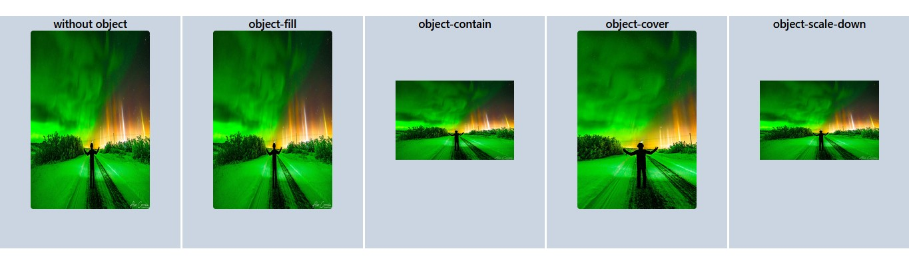

# object-fit
- অধিক রেজুলেশন ইমেজের সাইজ কমিয়ে যখন ওয়েবসাইটে প্রদর্শন করা হয়, তখন ইমেজটি দেখতে খারাপ দেখায়। তাই সাইজ কমিয়ে সুন্দরভাবে প্রদর্শনের জন্য object-fit প্রপার্টি ব্যবহার করা হয়।

- object-fill সাইজ কমানোর পর স্বাভাবিক ভাবে যেমন দেখায় তেমনেই দেখায়।
- object-contain কমানো সাইজেই পুরো ছবিটি সুন্দর গঠনে দেখায়। 
- object-cover কমানো সাইজে ডিফল্টভাবে ছবির সুন্দর দেখাতে সেন্টারের অংশটুকু দেখায়। বাকি দুই পাশ থেকে সুন্দর শেপ ঠিক রাখতে কেটে ফেলে। object-position এর মাধ্যমে নির্ধারণ করা যায় কোন অংশটুকু প্রদর্শন করতে হবে।
- object-scale-down কমানো সাইজে সে contain এর মত আচরণ করে। 



```js
<div className="flex items-center justify-center h-screen w-full space-x-1" >
      <div className="w-[500px] h-[500px] bg-slate-300 ">
        <h1 className="text-2xl font-semibold text-center">without object</h1>
        <div className="  flex items-center justify-center rounded-md">
          
        </div>
      </div>

      <div className="w-[500px] h-[500px] bg-slate-300 ">
        <h1 className="text-2xl font-semibold text-center">object-fill</h1>
        <div className="  flex items-center justify-center rounded-md">
          
        </div>
      </div>

      <div className="w-[500px] h-[500px] bg-slate-300 ">
        <h1 className="text-2xl font-semibold text-center">object-contain</h1>
        <div className="  flex items-center justify-center rounded-md">
          
        </div>
      </div>

      <div className="w-[500px] h-[500px] bg-slate-300 ">
        <h1 className="text-2xl font-semibold text-center">object-cover</h1>
        <div className="  flex items-center justify-center rounded-md">
          
        </div>
      </div>

      <div className="w-[500px] h-[500px] bg-slate-300 ">
        <h1 className="text-2xl font-semibold text-center">object-scale-down</h1>
        <div className="  flex items-center justify-center rounded-md">
          
        </div>
      </div>

    </div>
    ```