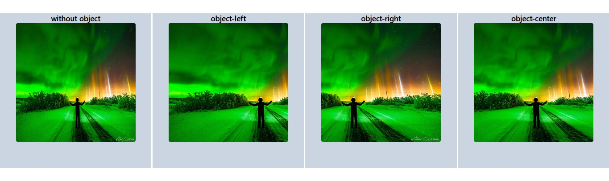

# object-position
- ইহা শুধুমাত্র  object-cover এর ক্ষেত্রে ব্যবহার করা হয় নির্ধারিত অংশ প্রদর্শনের জন্য। 



```js
<div className="flex items-center justify-center h-screen w-full space-x-1" >
      <div className="w-[500px] h-[500px] bg-slate-300 ">
        <h1 className="text-2xl font-semibold text-center">without object</h1>
        <div className="  flex items-center justify-center rounded-md">
          
        </div>
      </div>
      <div className="w-[500px] h-[500px] bg-slate-300 ">
        <h1 className="text-2xl font-semibold text-center">object-left</h1>
        <div className="  flex items-center justify-center rounded-md">
          
        </div>
      </div>
      <div className="w-[500px] h-[500px] bg-slate-300 ">
        <h1 className="text-2xl font-semibold text-center">object-right</h1>
        <div className="  flex items-center justify-center rounded-md">
          
        </div>
      </div>
      <div className="w-[500px] h-[500px] bg-slate-300 ">
        <h1 className="text-2xl font-semibold text-center">object-center</h1>
        <div className="  flex items-center justify-center rounded-md">
          
        </div>
      </div>
    </div>
```