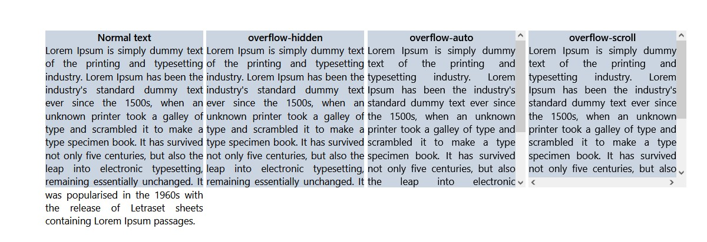

# overflow
- কোন একটি কনটেন্টের নির্দিষ্ট সাইজের বাইরে যখন তার চিলড্রেন প্রপার্টি চলে যায় তখন ওভারফ্লোকৃত প্রপার্টিগুলোকে কিভাবে প্রদর্শন করবে তা নির্ধারণ করার জন্য overflow ব্যবহার করা হয়। 
- overflow-hidden ওভারফ্লোকৃত প্রপার্টিগুলোকে হাইড হয়ে যাবে। 
- overflow-scroll দুইদিকে স্ক্রলবার আসবে এবং স্ক্রলিং করে দেখতে পারবে। 
- overflow-auto শুধুমাত্র যেদিকে স্ক্রলবার প্রদর্শনের জন্য শুধু  সেদিকে স্ক্রলবার আসবে।
- আরও অন্যন্য প্রপার্টি রয়েছে যাহা টেইলউইন্ড এর ডকুমেন্টেশনে রয়েছে। 



```js
<div className="flex items-center justify-center h-screen w-full space-x-2" >
      <div className="w-96 h-96 bg-slate-300 ">
        <h1 className="text-2xl font-semibold text-center">Normal text</h1>
        <p className="text-2xl text-justify">Lorem Ipsum is simply dummy text of the printing and typesetting industry. Lorem Ipsum has been the industry's standard dummy text ever since the 1500s, when an unknown printer took a galley of type and scrambled it to make a type specimen book. It has survived not only five centuries, but also the leap into electronic typesetting, remaining essentially unchanged. It was popularised in the 1960s with the release of Letraset sheets containing Lorem Ipsum passages.</p>
      </div>
      <div className="w-96 h-96 bg-slate-300 overflow-hidden ">
        <h1 className="text-2xl font-semibold text-center">overflow-hidden</h1>
        <p className="text-2xl text-justify">Lorem Ipsum is simply dummy text of the printing and typesetting industry. Lorem Ipsum has been the industry's standard dummy text ever since the 1500s, when an unknown printer took a galley of type and scrambled it to make a type specimen book. It has survived not only five centuries, but also the leap into electronic typesetting, remaining essentially unchanged. It was popularised in the 1960s with the release of Letraset sheets containing Lorem Ipsum passages.</p>
      </div>
      <div className="w-96 h-96 bg-slate-300 overflow-auto ">
        <h1 className="text-2xl font-semibold text-center">overflow-auto</h1>
        <p className="text-2xl text-justify">Lorem Ipsum is simply dummy text of the printing and typesetting industry. Lorem Ipsum has been the industry's standard dummy text ever since the 1500s, when an unknown printer took a galley of type and scrambled it to make a type specimen book. It has survived not only five centuries, but also the leap into electronic typesetting, remaining essentially unchanged. It was popularised in the 1960s with the release of Letraset sheets containing Lorem Ipsum passages.</p>
      </div>
      <div className="w-96 h-96 bg-slate-300 overflow-scroll ">
        <h1 className="text-2xl font-semibold text-center">overflow-scroll</h1>
        <p className="text-2xl text-justify">Lorem Ipsum is simply dummy text of the printing and typesetting industry. Lorem Ipsum has been the industry's standard dummy text ever since the 1500s, when an unknown printer took a galley of type and scrambled it to make a type specimen book. It has survived not only five centuries, but also the leap into electronic typesetting, remaining essentially unchanged. It was popularised in the 1960s with the release of Letraset sheets containing Lorem Ipsum passages.</p>
      </div>
      
    </div>
```