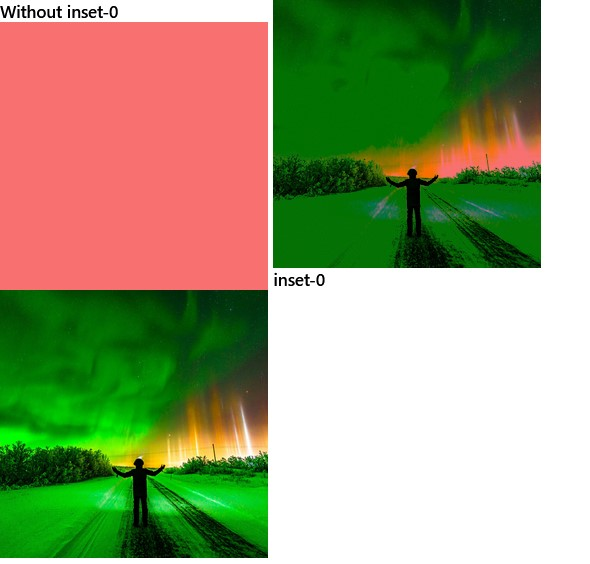
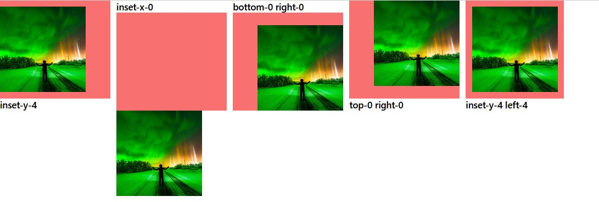

# top/bottom/left/right
- ইহা ব্যবহার এলিমেন্টের পজিশন নির্ধারণ করার জন্য। 
# inset
## Syntex:
### inset-value:
- top
- bottom
- left
- right
## Example:
- দুইটি এলিমেন্টের সাইজ সমান হওয়ায় inset-0 ব্যবহার কারণে ওভারলেপিং করে নিয়েছে। 

### inset-y-value
- top
- bottom
### inset-x-value
- left
- right
