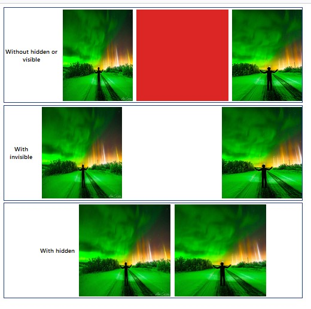

# Visibility
- ইহা ব্যবহার করা হয় এলিমেন্ট কে প্রদর্শন বা হাইড করার জন্য। এছাড়া টেবিলের রো বা কলামকে মার্জিং করার জন্য। 
- ইহার মাধ্যমে এলিমেন্টকে হাইড করলে উক্ত এলিমেন্ট তার স্থানে তথা ডমে থেকেই যায় ফলে তার পরবর্তী তার স্থান দখল করেনা। 
- display-hidden এর মাধ্যমে কোন এলিমেন্টকে হাইড করলে উক্ত এলিমেন্ট তার স্থান ছেড়ে দেয় ফলে পরবর্তী এলিমেন্ট তার স্থান দখল করে নেয়। 

# Difference between invisible and hidden


```js
<div className="flex-col space-y-2 m-4">
      <div className="flex w-[1250px] h-[400px] items-center justify-center space-x-4 border-4 border-blue-900 ">
        <h1 className="text-2xl font-semibold text-center">
          Without hidden or visible
        </h1>
        <div className="w-96 h-96">
          
        </div>
        <div className="w-96 h-96">
          <div className="w-96 h-96 bg-red-600"></div>
        </div>
        <div className="w-96 h-96">
          
        </div>
      </div>
      {/* ..............with invisible.................... */}
      <div className="flex w-[1250px] h-[400px] items-center justify-center space-x-4 border-4 border-blue-900 ">
        <h1 className="text-2xl font-semibold text-center">With invisible</h1>
        <div className="w-96 h-96">
          
        </div>
        <div className="w-96 h-96 invisible">
          <div className="w-96 h-96 bg-red-600"></div>
        </div>
        <div className="w-96 h-96">
          
        </div>
      </div>
      {/* ..............with display hidden.................... */}
      <div className="flex w-[1250px] h-[400px] items-center justify-center space-x-4 border-4 border-blue-900 ">
        <h1 className="text-2xl font-semibold text-center">With hidden</h1>
        <div className="w-96 h-96">
          
        </div>
        <div className="w-96 h-96 hidden">
          <div className="w-96 h-96 bg-red-600"></div>
        </div>
        <div className="w-96 h-96">
          
        </div>
      </div>
    </div>
```