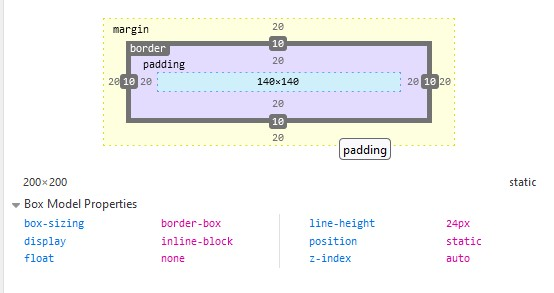
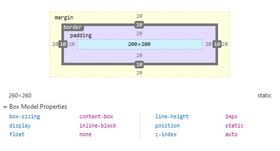

# Box-sizing 
- ইহা ব্যবহার করা হয় বক্সের সাইজ নির্ধারণ করার জন্য।
## Border-box
- Tailwind by-default border-box
- মার্জিন, প্যাডিং ও বর্ডার এর পড়ার পর বাকিটুকু হবে বক্সের সাইজ।
- ইহা ব্যবহার করলে বক্সের সাইজ হবে -
```
Main box width = Width - (Margin + Padding + border width)
               = 200px - (20px + 20px + 10px)
               = 200px - 50px
               = 150px
```


## content-box
- বক্সের মুল সাইজ ঠিক থেকে মার্জিন, প্যাডিং ও বর্ডার তার বাহিরে পড়বে। 
- ইহা ব্যবহার করলে বক্সের সাইজ হবে -
```
Main box width = Width + (Margin + Padding + border width)
               = 200px + (20px + 20px + 10px)
               = 200px + 50px
               = 250px
```
