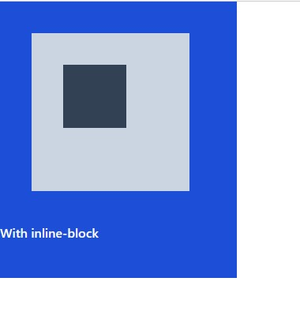

# Margin
- মার্জিন কাজ করে বর্ডারের বাহিরে প্যারেন্টস এর সাপেক্ষে। 
- প্যাডিং কাজ করে বর্ডারের ভিতরে নিজের সাপেক্ষে। 
```js
<div className="flex space-x-2">
      <div className="w-[300px] h-[300px] bg-blue-700">
        <div className="w-[200px] h-[200px] bg-slate-300">
          <div className="w-[5rem] h-[5rem] bg-slate-700"></div>
        </div>
        <h2 className="text-white font-semibold">Without margin and padding</h2>
      </div>

      <div className="w-[300px] h-[300px] bg-blue-700 mt-10 p-10">
        <div className="w-[200px] h-[200px] bg-slate-300">
          <div className="w-[5rem] h-[5rem] bg-slate-700"></div>
        </div>
        <h2 className="text-white font-semibold">With margin and padding</h2>
      </div>
</div>
```
## Result:
- এখানে প্রথম ইমেজে কোন মার্জিন বা পেডিং ব্যবহার করা হয়নি।
- ২য় ইমেজে মার্জিং mt-10 ব্যবহারের কারণে উক্ত ডিভটি তার প্যারেন্টস বডির সাপেক্ষে তার বর্ডারের বাহিরে টপ থেকে মার্জিন নিয়েছে। 
- ২য় ইমেজে প্যাডিং p-10 ব্যবহারের কারণে একই ডিভ তার নিজের সাপেক্ষে চতুর্দিকে বর্ডারের ভিতেরর দিকে প্যাডিং নিয়েছে।


# Margins Rule - Without inline-block or flex
- মেইন বডি ব্যতিত কোন ডিভের সাপেক্ষে উক্ত ডিভের চাইল্ডকে মার্জিন দিলে টপ মার্জিন করবেনা (যদি চাইল্ডকে ব্লক এলিমেন্ট হয়)। সেক্ষেত্রে চাইল্ডকে inline-block or flex করতে হবে।

```js
<div>
      <div className="w-[300px] h-[350px] bg-blue-700">
        <div className="w-[200px] h-[200px] bg-slate-300 m-10">
          <div className="w-[5rem] h-[5rem] bg-slate-700 m-10"></div>
        </div>
        <h2 className="text-white font-semibold">Without inline-block</h2>
      </div>
    </div>
```
## Result:
- ২য় ও তয় উভয় ডিভ তাদের প্যারেন্টস এর সাপেক্ষে টপ ব্যতিত মার্জিন নিয়েছে।


# Margins Rule - With inline-block or flex
```js
<div>
      <div className="w-[300px] h-[350px] bg-blue-700">
        <div className="w-[200px] h-[200px] bg-slate-300 m-10 inline-block ">
          <div className="w-[5rem] h-[5rem] bg-slate-700 m-10 inline-block"></div>
        </div>
        <h2 className="text-white font-semibold">With inline-block</h2>
      </div>
    </div>
```
## Result:
- ২য় ও তয় উভয় ডিভ inline-block করার কারণে তাদের প্যারেন্টস এর সাপেক্ষে টপ সজ চতুর্দিকে মার্জিন নিয়েছে।



# inline Vs inline-block
 ```js
 <div className="bg-blue-700 w-48 h-48 m-6">
        <span className="bg-blue-200 m-4 p-4 w-36 h-36 ">
          I am inline element
        </span>
      </div>

      <div className="bg-purple-700 w-48 h-48 m-6">
        <span className="inline-block bg-green-300 m-4 p-4 w-36 h-36">
          I am inline-block element
        </span>
      </div>
 ```
 ## Result:
 - inline এলিমেন্টে top margin, top padding, width, height কাজ করবেনা। এখানে মার্জিং এবং প্যাডিং কাজ করেছে কিন্তু টপে কাজ করেনি। প্যাডিং যদিও দেখা যাচ্ছে কিন্তু েকনটেন্ট তার নিজ স্থানেই রয়েছে। 
 - নিচে span ট্যাগ inline হওয়া সত্ত্বেও তাহাকে inline-block হিসেবে ব্যবহার কারণে তার মধ্যে সবই কাজ করেছে। 
 
 

 # Rule about padding and margin
 
 ```js
  <div className="flex text-white">
      <div className="bg-blue-700 w-48 h-48 m-6">
        <p>
          I am <span>inline</span> element
        </p>
      </div>

      <div className="bg-purple-700 w-60 h-48 m-6">
        <p>
          I am <span className="inline-block bg-red-400 w-32 p-5 mt-2">inline-block</span> element
        </p>
      </div>

      <div className="bg-green-700 w-48 h-48 m-6">
        <p>
        I am <span className="block bg-slate-400 w-32 p-5 mt-2">block</span> element
        </p>
      </div>
    </div>
 ```
 ## Result:
 - span ট্যাগ inline এলিমেন্ট তাহাকে inline-block করে তার মধ্যে ব্লক এর মত সমস্ত সিএএস এপ্লাই করা হয়েছে এবং কাজ করেছে কিন্তু সে inline ই রয়েছে কারণ সে তার লাইন ছাড়েনি। 
 -  span ট্যাগ inline এলিমেন্ট তাহাকে block করে তার মধ্যে ব্লক এর মত সমস্ত সিএএস এপ্লাই করা হয়েছে এবং কাজ করেছে কিন্তু সে সম্পূর্ণভাবে block এলিমেন্ট হয়ে গিয়েছে। কারণ সে লাইন ছেড়ে নিজে সম্পূর্ণ একটি ব্লক দখল করেছে।
 